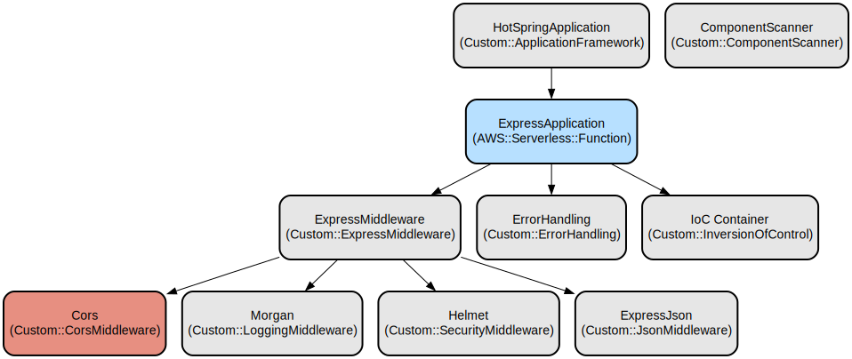

# HotSpring - A Lightweight TypeScript Framework with Dependency Injection

HotSpring is a modern TypeScript framework built on top of Express.js that provides dependency injection, decorators for routing, and structured application organization. It simplifies building scalable web applications by offering Spring-style annotations and automated component scanning.

The framework features automatic dependency injection through Inversify, decorator-based routing similar to Spring Boot, component scanning for automatic registration of services and controllers, and a robust logging system. It provides a clean architecture pattern separating concerns into controllers, services, and repositories while maintaining type safety through TypeScript.

## Repository Structure
```
.
├── docs/               # Documentation files
├── src/               # Source code
│   ├── @type/         # TypeScript type definitions
│   ├── common/        # Common utilities and annotations
│   │   ├── annotations/
│   │   ├── enums/
│   ├── core/         # Core framework implementation
│   │   ├── exception/
│   │   ├── framework/
│   ├── exemples/     # Example implementations
│   └── repository/   # Repository implementations
```

## Usage Instructions
### Prerequisites
- Node.js (v16 or higher)
- TypeScript (v4.5 or higher)
- npm or yarn package manager

### Installation
```bash
# Clone the repository
git clone <repository-url>
cd hotspring

# Install dependencies
npm install

# For yarn users
yarn install
```

### Quick Start
1. Create a new controller:
```typescript
import { Controller, Get } from '@common/annotations';

@Controller('/api')
export class UserController {
  @Get('/users')
  public async getUsers() {
    return { users: [] };
  }
}
```

2. Create a main application file:
```typescript
import { HotSpringApplication } from '@common/annotations';

@HotSpringApplication({
  scanBasePackages: ['controllers', 'services', 'repository']
})
export class Main {
  public static async start(): Promise<void> {
    // Application will automatically scan and register components
  }
}
```

3. Run the application:
```bash
npm run dev
```

### More Detailed Examples
1. Creating a Service with Dependency Injection:
```typescript
import { Service } from '@common/annotations';

@Service()
export class UserService {
  public async findAll() {
    return [];
  }
}

@Controller('/api')
export class UserController {
  constructor(private userService: UserService) {}

  @Get('/users')
  public async getUsers() {
    return await this.userService.findAll();
  }
}
```

### Troubleshooting
1. Component Scanning Issues
- Problem: Components not being detected
- Solution: Ensure components are decorated with @Controller, @Service, or @Repository
- Debug: Enable debug logging in Logger configuration

2. Dependency Injection Errors
- Problem: "No matching bindings found"
- Solution: Verify that all dependencies are properly decorated and included in scanBasePackages
- Debug: Check container bindings using:
```typescript
console.log(container.getAll());
```

## Data Flow
HotSpring follows a traditional three-tier architecture where requests flow through controllers, services, and repositories. The framework handles dependency injection and request routing automatically.

```ascii
Client Request → Controller → Service → Repository → Database
     ↑            ↓           ↓          ↓            ↓
     └────────────────────Response────────────────────┘
```

Component interactions:
1. Controllers receive HTTP requests and handle routing
2. Services contain business logic and orchestrate operations
3. Repositories handle data access and persistence
4. Dependency injection manages component lifecycle and dependencies
5. Express middleware processes requests before reaching controllers
6. Error handling is centralized through the exception system
7. Logging occurs at each layer for debugging and monitoring

## Infrastructure


The framework provides the following core infrastructure:

### Express Configuration
- Bootstrap: Configures Express application with middleware and error handling
- Middleware: Configures CORS, body parsing, security headers, and logging
- Error Handling: Global error handling and status code mapping

### Dependency Injection
- Container: Inversify-based IoC container for dependency management
- Component Scanning: Automatic discovery and registration of annotated classes
- Lifecycle Management: Handles component instantiation and dependency resolution

### Logging
- Winston-based logging system with customizable formats
- Support for console and file-based logging
- Different log levels (DEBUG, INFO, WARN, ERROR)
